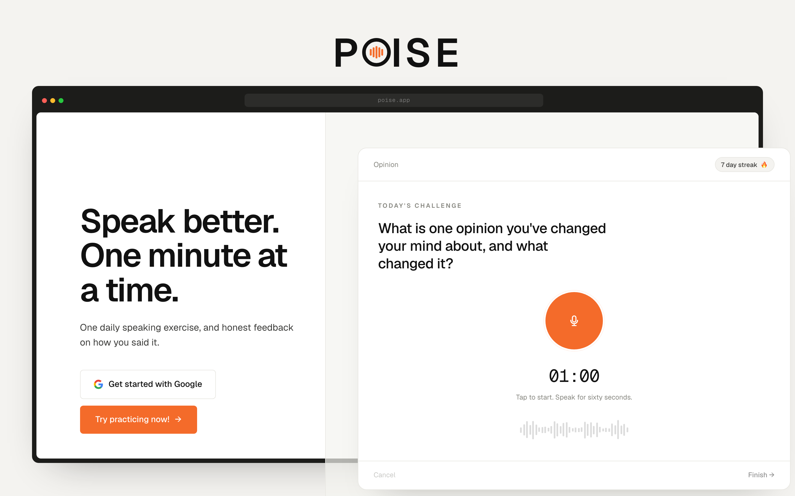
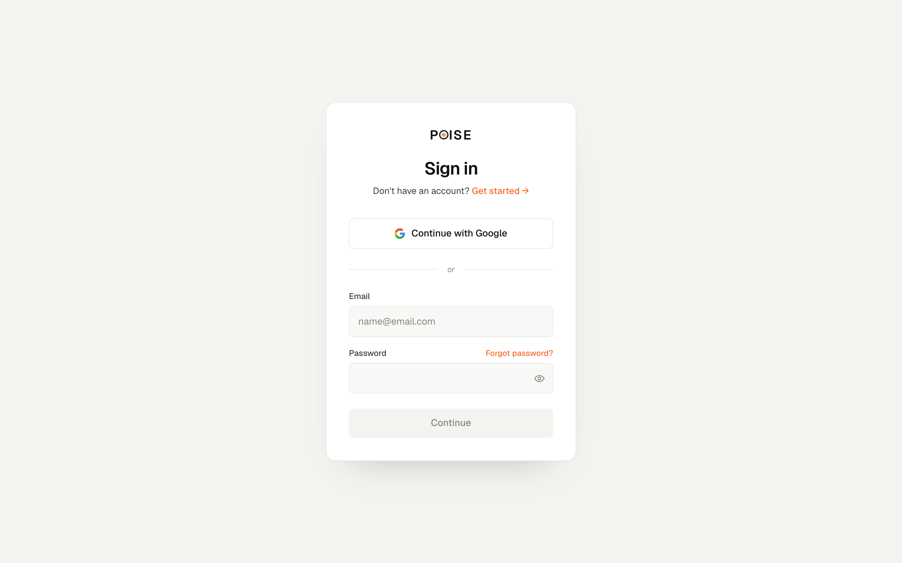
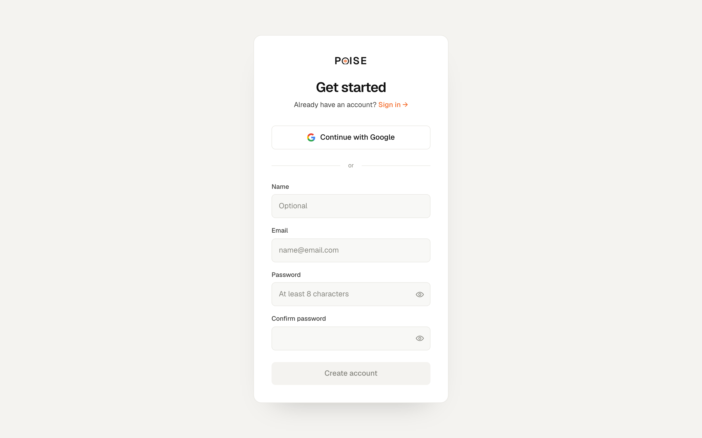
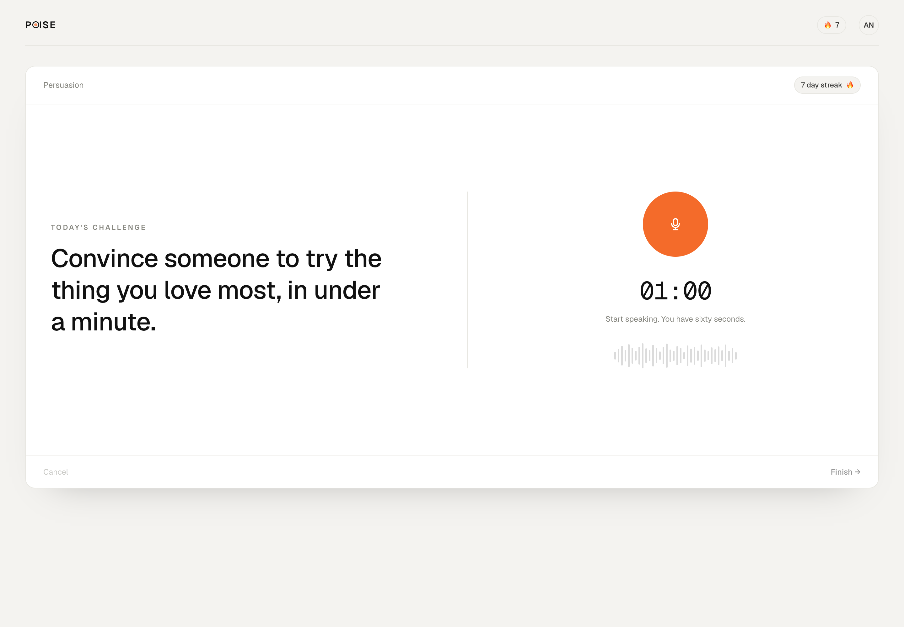
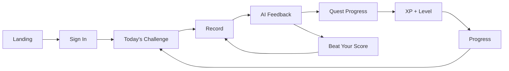
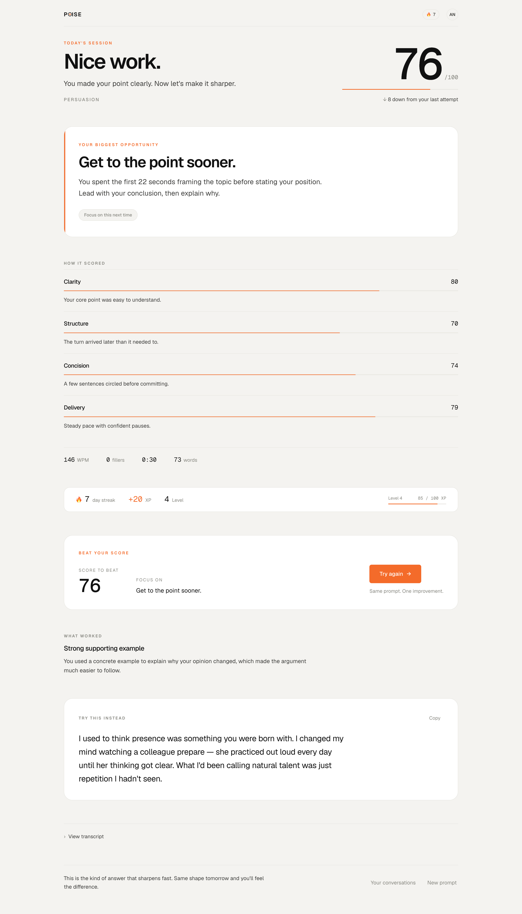
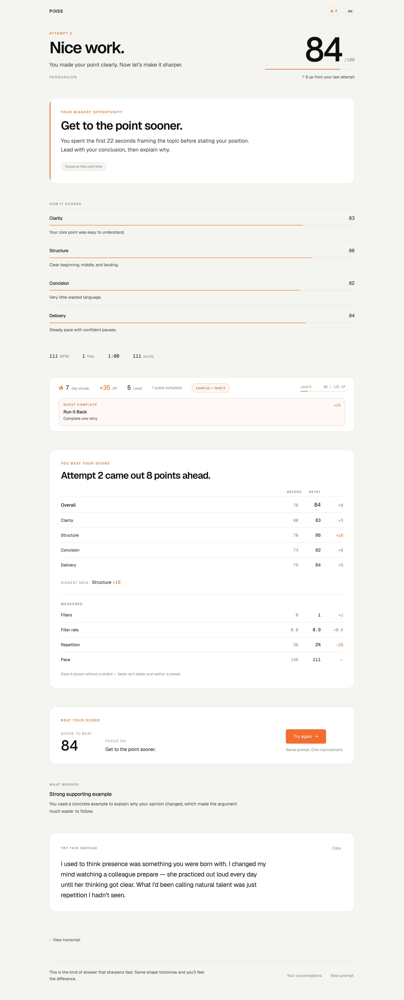
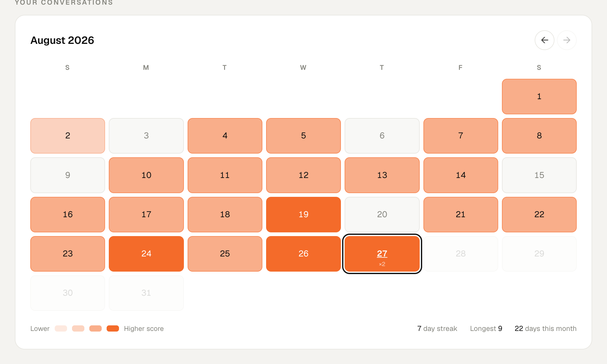

# Poise

Poise is a daily speaking coach. Users practice communication through short
challenges, receive structured feedback, and improve through a retry loop that
turns that feedback into immediate action.

The product thesis is that analyzing one speech is not very useful. Getting
better at speaking is a practice problem, not an analysis problem, so Poise is
built around repetition:

1. Complete a daily speaking challenge, up to 60 seconds.
2. Receive structured feedback across four scored dimensions.
3. Get one clear improvement target, not a list of them.
4. Retry the same prompt to beat the previous score.
5. Complete two daily quests.
6. Build a streak and a level over time.
7. Track how speaking changes across sessions.

I built Poise to explore how product mechanics can turn a simple AI utility into
a habit-forming learning experience.

## Demo

<p align="center">
  
</p>

<table>
<tr>
<th width="33%">Sign in</th>
<th width="33%">Sign up</th>
<th width="33%">Practice</th>
</tr>
<tr>
<td></td>
<td></td>
<td align="center"><code>docs/images/practice.png</code></td>
</tr>
</table>

<!-- Remaining cells are placeholders. Replace each one with an image tag, for example:
     <td></td>
-->

<table>
<tr>
<th width="33%">Recording</th>
<th width="33%">Daily quests</th>
<th width="33%">Progress</th>
</tr>
<tr>
<td align="center"><code>docs/images/recording.png</code></td>
<td align="center"><code>docs/images/quests.png</code></td>
<td align="center"><code>docs/images/progress.png</code></td>
</tr>
</table>

**Core flow:** sign in → today's challenge → record up to 60 seconds → scored
feedback → one coaching focus → beat your score → streak, XP, and quests.

## Why I built Poise

A lot of AI products stop at one shape:

```
input -> model -> output
```

That shape produces a moment of insight and then nothing. The user reads the
feedback, agrees with it, closes the tab, and does not get any better. The
feedback was correct and completely inert.

Poise is designed around a different shape:

```
practice -> feedback -> action -> retry -> progress
```

The core product question behind the whole thing was: **how do you turn feedback
into repeated behavior?**

The gamification is the answer to that question, which is why it is not
decorative. Each mechanic reinforces a specific learning behavior:

| Mechanic | Behavior it reinforces |
| --- | --- |
| Streaks | Showing up on consecutive days |
| Daily quests | Practicing with one concrete objective instead of a vague goal |
| Beat Your Score | Applying feedback immediately, while it is still fresh |
| XP and levels | Staying with it long enough for progress to compound |
| Practice calendar | Seeing accumulated effort, which is what makes a habit feel real |

The distinction that matters most: XP rewards **effort and deliberate practice**,
not raw speaking ability. A user who starts weak and practices daily should
out-level a naturally strong speaker who shows up twice. If progression tracked
skill, the people who most need the practice would be the ones the system
punished.

## The experience

The product loop, end to end:



### 1. Start with a daily challenge

The landing page makes one promise ("Speak better. One minute at a time.") and
offers one action. There is no feature tour, because the product only works if
someone actually records something.

```
Landing -> Today's Challenge
```

### 2. Create your account

Firebase Authentication provides persistent identity, which is what lets a
streak, a level, and a history belong to someone. Google sign-in and email with
password are both supported, along with password reset.

```
Sign in -> Google OAuth -> persistent Poise profile
```

### 3. Speak

The user gets the day's prompt and records directly in the browser, with a live
waveform so they can see the microphone is working. Recording is capped at 60
seconds and needs at least 5 to count.

The practice screen deliberately shows almost nothing else. Someone who is about
to speak for a minute does not need their streak, their level, and their quest
list competing for attention.

### 4. Get coached

The results page returns an overall score, four dimension scores (clarity,
structure, concision, delivery), the single highest-leverage improvement, what
actually worked, deterministic speech metrics, and a rewritten version of the
user's own answer.

It is built around one question: **what should I do differently on my next
attempt?** The primary improvement gets the most visual weight on the page, and
praise sits below it. Praise is what makes someone feel good about the session
they just finished. The improvement is what makes the next one better.

<!-- SCREENSHOT: add docs/images/results.png (worth a tall, full-width capture), then replace this comment with:

-->

*Screenshot placeholder: `docs/images/results.png`*

### 5. Complete quests

Each user gets two quests per day, one standard and one stretch. Quests turn
"speak better" into something a person can actually aim at during a single
60-second recording:

> **Clean Run**
> Use 5 or fewer filler words.

> **Crystal Clear**
> Score 80 or higher in Clarity.

Quests are evaluated on the server from persisted session data. The browser
cannot mark one complete, because a quest the user can award themselves is not
an objective.

### 6. Beat your score

This is the center of the product.

```
Attempt 1 -> Feedback -> One coaching focus -> Same prompt -> Attempt 2 -> Side-by-side comparison
```

The prompt stays constant on purpose. A better score on an easier question tells
the user nothing, so holding the task fixed is what makes the second attempt
evidence.

The retry screen shows the attempt number, the score to beat, and the one
coaching focus, and nothing else. Afterward the user sees a direct comparison of
overall score, each dimension, filler counts, and repetition. They are not just
told what to improve. They immediately try to apply it, and then find out
whether it worked.

<!-- SCREENSHOT: add docs/images/beat-your-score.png (large capture, this is a key screen), then replace with:

-->

*Screenshot placeholder: `docs/images/beat-your-score.png`*

### 7. Build momentum

`/conversations` is the user's practice history and dashboard. It brings
together the current streak, longest streak, level and XP progress, today's
quests, whether today's challenge is done, and a practice calendar. Selecting a
day shows the sessions recorded that day and links through to those results.

<!-- SCREENSHOT: add docs/images/calendar.png, then replace this comment with:

-->

*Screenshot placeholder: `docs/images/calendar.png`*

The longer loop:

```
Practice -> Feedback -> Retry -> Quest -> XP -> Level -> Streak -> Progress
```

## Product flows

| Route | What it does | Worth noting |
| --- | --- | --- |
| `/` | Landing | Statically rendered and reads no session, so a first-time visitor gets it instantly. |
| `/signin`, `/signup`, `/reset-password` | Account entry | Firebase Authentication with Google OAuth and email with password. |
| `/practice` | The day's prompt and recorder | Native `MediaRecorder` capture, Web Audio waveform, 5 to 60 seconds. |
| `/results/[id]` | Scores, coaching, rewards | Retry comparison appears first when the session is itself a retry. |
| `/conversations` | History and dashboard | Streak, level, quests, and the practice calendar. |

Two details behind those routes matter more than the rest.

**Session handling.** The client exchanges its Firebase ID token for an httpOnly
session cookie at `/api/auth/session`, which the server verifies on every
request. Identity is always resolved server-side, so a browser-supplied user id
is never trusted. On first Google sign-in a profile document is created in
Firestore; every later sign-in merges into it rather than resetting it, so
history, streaks, and XP survive.

**Recording.** The container format is picked from what the browser actually
supports. Permission failures, missing microphones, and hardware already in use
each get specific copy rather than one generic error, and audio is submitted for
analysis only after a valid completion.

## Gamification

### Streaks

Streaks reward consecutive days of practice, and count **days, not attempts**.
Retries advance the total session count but never the streak or the practice-day
count. Practicing hard on Tuesday is not the same as practicing on Tuesday and
Wednesday, and a mechanic that rewards consistency has to actually measure it.

### Daily quests

Two per day, one standard and one stretch, drawn from a central registry:

| Standard | Stretch |
| --- | --- |
| Clean Run: 5 or fewer filler words | Crystal Clear: 80+ in Clarity |
| Show Up: complete today's challenge | Straight to It: 80+ in Concision |
| Smooth Pace: stay between 120 and 170 WPM | Well Structured: 80+ in Structure |
| Run It Back: complete one retry | Beat Yourself: improve on a retry |
| | Personal Best: set a new overall high score |
| | Cleaner Take: use fewer filler words on a retry |

Assignment is derived deterministically from the user id and the date, so it is
stable across refreshes without needing a write, identical on every server, and
reproducible for any past date. Retry quests are withheld from users who have
nothing to retry yet, so a brand new account never opens to an impossible
objective.

### Beat Your Score

Covered above, and the mechanic the rest of the system is arranged around. A
retry stores its parent session id and attempt number, reuses the parent's
prompt, and is excluded from streak and practice-day arithmetic.

### XP and levels

XP is awarded for behaviors rather than for scores:

| Event | XP |
| --- | --- |
| Completing the daily challenge | 20 |
| First retry of the day | 10 |
| A retry that improved on its parent | 10 |
| Setting a personal best | 10 |
| Each quest completed | 15 |

Level is derived from total XP and never stored, so the two can never disagree.
Thresholds widen as they go (0, 50, 120, 200, 300, 425, 575 and onward), so
early levels arrive fast enough for a new user to see the system respond, while
later ones take a habit rather than an afternoon.

Awards are written as events with deterministic ids, which makes them idempotent:
a double-submit or two concurrent uploads can both try to award the same thing
and only one will land. Most awards are keyed by day rather than by session, so
"completed a retry" pays out once a day instead of paying forever.

### Calendar and progress

The calendar makes consistency visible. A month of filled squares is a different
kind of feedback from a score, and it is the one that makes a user feel they
have built something worth not breaking.

## Scoring

A score is deliberately **not** a single unconstrained LLM judgment. The system
combines four things:

1. Deterministic, measurable speech metrics.
2. Rubric-based LLM evaluation with anchored score bands.
3. Deterministic constraints applied to what the model returned.
4. Deterministic overall-score weighting.

This was necessary because an earlier version scored a roughly 10-second
incomplete response above 50. The model saw a short answer and read it as
concise. It was not concise, it was unfinished, and rewarding it taught exactly
the wrong lesson.

The current system distinguishes **concise from incomplete**, and **fast from
effective**.

The model proposes and the measurements dispose. Every constraint is a ceiling,
never a boost: a measurement can prove an answer was too short to have
structure, but no measurement proves an answer was good.

### Response completeness

Very short responses are capped, because there is not enough evidence to
conclude a response was well structured or complete. Completeness is assessed
from duration and word count together, since 20 seconds of dense speech and 20
seconds with long pauses are different answers.

Bands run from extremely short, through severely incomplete and partial, up to
the normal response range. Structure is capped hardest, because a fragment
cannot have an arc. Clarity is capped most gently, because a short answer can
still be perfectly understandable. A response under 8 seconds is marked
insufficient, and the results page says it was too short for a full evaluation
rather than presenting a capped number as a normal score.

Crucially, a complete argument made efficiently in 35 seconds is **not**
penalized: a word count high enough to constitute a real answer promotes the
response out of the short-answer bands. Efficiency should not be scored as
incompleteness.

### Pace

Words per minute is calculated deterministically. Very slow and very fast
delivery both reduce delivery quality, applied on a slope rather than a hard
step so that 171 WPM is not treated as meaningfully worse than 169.

There is no single perfect speaking rate, and the comfortable band is wide on
purpose. A narrow ideal would penalize natural variation rather than genuine
problems.

### Filler words

Filler rate is measured **relative to word count**, not as a raw count. Five
fillers in a 200-word answer is clean speech; five in a 30-word answer is not. A
raw count would penalize long answers for being long.

### Repetition

High repetition constrains concision, measured as the share of three-word
sequences that repeat. Repeating the same point is different from developing it,
and a listener notices a repeated phrase far more than a repeated word.

### Incompleteness

**A short answer is not automatically concise.** This is stated explicitly in
the model's rubric and enforced afterward in code, because it was the single
biggest source of implausible scores in the first version.

### Overall score

The overall score is always computed by the app from the four constrained
dimensions:

| Dimension | Weight |
| --- | --- |
| Clarity | 30% |
| Structure | 25% |
| Concision | 25% |
| Delivery | 20% |

The model never returns an overall score and never controls it directly. Keeping
the weighting in code means the number is reproducible and any change in it
traces back to a dimension.

Scoring logic is versioned. Every session records the version that produced it,
and historical sessions are never rescored, so results a user has already seen
stay stable as the rubric evolves. Calibration does differ across versions, and
that trade is documented rather than hidden.

## Key product decisions

**Let users practice before overwhelming them with UI.** The practice screen
stays focused on the prompt and the recorder. Progression belongs on the
dashboard, not in front of someone about to speak.

**Improvement before praise.** The results page leads with the highest-leverage
improvement so the user always knows what to do next.

**One coaching focus at a time.** The model is instructed to identify exactly one
improvement. A list of six things to fix is a list of six things nobody does.

**Retry the same prompt.** Changing the prompt would make the comparison
meaningless. Beat Your Score keeps the task constant so the delta means
something.

**Streaks count days, not attempts.** Multiple retries in one sitting should not
inflate a consistency metric.

**XP rewards effort.** A less skilled user who practices daily should progress
faster than a strong speaker who appears occasionally.

**Deterministic metrics are facts.** Duration, word count, WPM, filler counts,
repetition, and lexical diversity are measured in code, never invented by the
model. They are given to the model as evidence and shown to the user as fact.

**Server owns every write.** Firestore rules deny all client writes. XP, quests,
streaks, and personal bests are decided server-side inside a transaction, so a
browser cannot forge a score or inflate a streak.

## Architecture

**Frontend**
- Next.js (App Router)
- TypeScript
- Tailwind CSS

**Authentication**
- Firebase Authentication
- Google OAuth and email with password, plus password reset
- httpOnly session cookies, verified server-side on every request

**Persistence (Firestore)**
- `users/{uid}`: profile, streak state, totals, XP
- `users/{uid}/dailyQuests/{YYYY-MM-DD}`: quest assignment and completion
- `users/{uid}/xpEvents/{eventId}`: idempotent XP award records
- `practiceSessions/{id}`: transcript, scores, metrics, feedback, gamification outcome
- `dailyPrompts/{YYYY-MM-DD}`: the generated daily challenge

**AI**
- OpenAI transcription
- Structured LLM scoring and coaching against a written rubric, returned as a
  validated schema

**Browser**
- Native `MediaRecorder` for capture
- Web Audio API for the live waveform

## Data flow

```
recording
  -> authenticated API request      (session cookie verified first)
  -> transcription                  (OpenAI)
  -> deterministic metrics          (lib/scoring/metrics.ts)
  -> structured scoring             (lib/openai.ts)
  -> score constraints              (lib/scoring/constraints.ts)
  -> overall score                  (fixed weighting, computed in code)
  -> streak / quest / XP evaluation (single Firestore transaction)
  -> Firestore
  -> results
```

Three properties this ordering is designed to guarantee:

- **Identity is verified before expensive work.** The session cookie is checked
  before any transcription or scoring call, so an unauthenticated request cannot
  cost money.
- **Transcripts are never written to production logs.** Logs carry request ids,
  timings, scores, and the reasons constraints were applied, never speech.
- **Firestore writes are server-controlled.** The session write and the streak,
  quest, and XP updates happen in one transaction, so a session can never exist
  without its streak reflecting it, and two concurrent submissions cannot
  double-award.

## Local setup

```bash
npm install
cp .env.example .env.local
```

Fill in `.env.local`. See `.env.example` for the full annotated list, including
how to handle the multi-line Firebase private key. You will need:

1. **A Firebase project**, with **Google** and **Email/Password** enabled under
   Authentication > Sign-in method.
2. **The web config** (Project Settings > General > Your apps). These are the
   `NEXT_PUBLIC_FIREBASE_*` values and are safe to expose.
3. **A service account** (Project Settings > Service accounts). Server-only, and
   must never carry a `NEXT_PUBLIC_` prefix.
4. **Firestore**, then deploy rules and indexes with
   `npx firebase-tools deploy --only firestore:rules,firestore:indexes`.
5. **An OpenAI API key** in `OPENAI_API_KEY`.

Then `npm run dev`.

To work on the UI without spending API credits, set `POISE_SCORING_MODE=mock`.
Mock mode fabricates the transcript and coaching text but runs the real metric
and constraint pipeline, so short recordings are penalized exactly as they would
be in production.

```bash
npm run check      # deterministic assertion suites
npx tsc --noEmit   # typecheck
npm run build      # production build
```

## Current limitations

- **Scoring is coaching-oriented, not a validated assessment.** It is designed to
  give a user something actionable to work on, and has not been validated
  against any clinical or educational instrument.
- **Audio is not stored.** Recordings are transcribed and discarded, so there is
  no playback and no way to listen back to an earlier attempt. Only the
  transcript and metrics persist.
- **No score trend chart yet.** History is browsable through the calendar and
  per-session results, but there is no chart of scores over time.
- **History is capped at 365 sessions** on the conversations page, which is
  ample today but is a fixed ceiling rather than paging.
- **Scores are not comparable across scoring versions.** A v1 score and a v2
  score can differ for the same performance. Old sessions are intentionally left
  unrescored.
- **No reminders or notifications**, which is a real gap for a product built
  around a daily habit.

## Future improvements

### ML-based scoring

A future version could replace or augment parts of the current LLM-based scoring
with a supervised model trained on human-tagged speech, using real human labels
for dimensions such as clarity, structure, concision, delivery, and fluency.

Candidate inputs, most of which Poise already computes:

- words per minute
- filler rate
- repetition rate
- pause frequency and pause duration (not currently measured)
- lexical diversity
- sentence-level structure
- acoustic features (would require retaining audio)

The appeal is empirical grounding. Today's dimension scores rest on model
judgment constrained by heuristics I chose, and while those constraints keep the
output plausible, the thresholds are reasoned rather than fitted to data.

This is a data problem before it is a modeling problem, and it is genuinely
unsolved here. I am not aware of a public human-rated speech dataset that maps
onto Poise's rubric, and a model trained on a small or inconsistently rated set
would be less trustworthy than the current system, not more. A serious version
would need a large corpus rated consistently by humans against this rubric. The
plausible path is to build that dataset rather than find it, by collecting
opt-in ratings and expert annotations from real sessions over time. That is a
research effort, and nothing in Poise does it today.

### Other directions

- **Richer audio-level delivery analysis.** Pauses, pitch variation, and volume
  are real components of delivery that a transcript cannot capture, which is
  exactly why the model is forbidden from commenting on them today.
- **Scoring calibrated to a user's baseline**, so feedback reflects personal
  improvement rather than an absolute standard.
- **Audio playback and session review**, which would also unlock the acoustic
  features above.
- **Adaptive prompt difficulty and personalized quests**, targeting the
  dimension a user is weakest on.
- **Reminders**, the most direct fix for the habit gap noted above.
