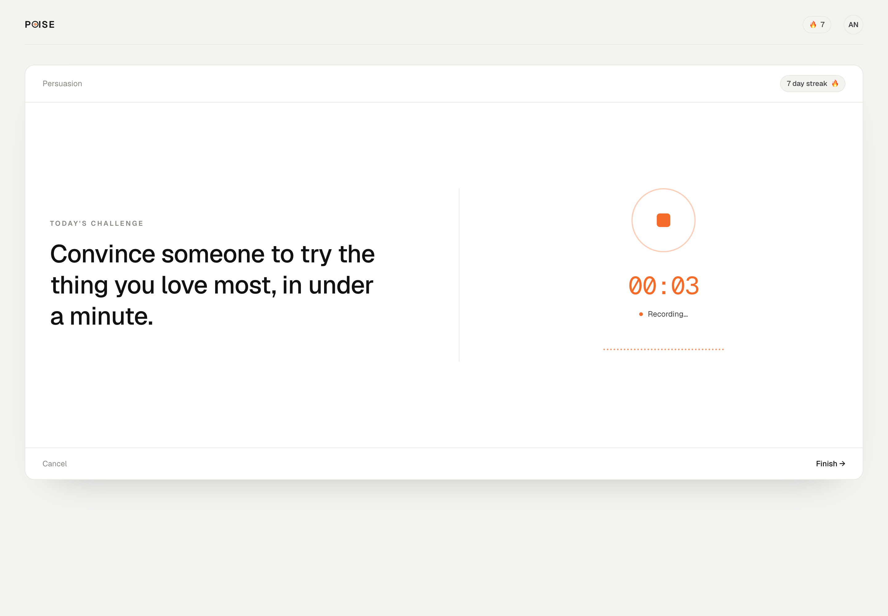
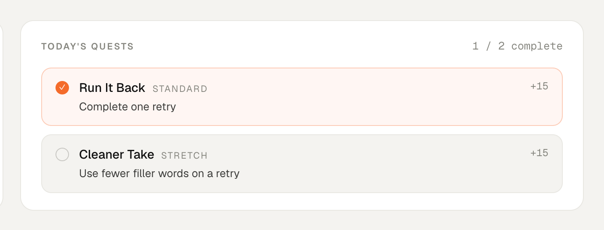
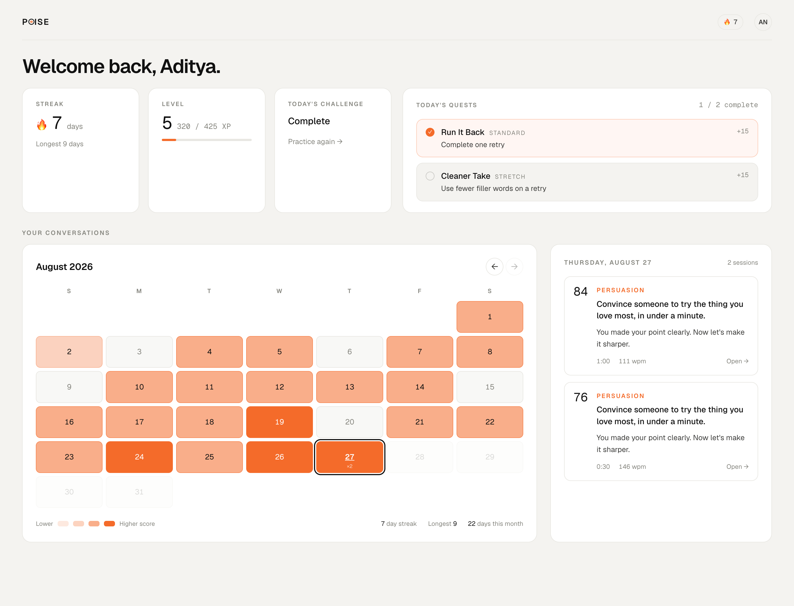
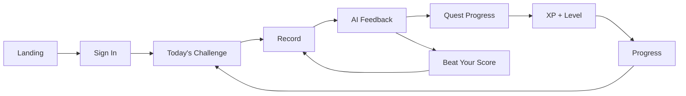

# Poise

Poise is a daily speaking coach. Users practice through short challenges,
get structured feedback, and improve through a retry loop that turns that
feedback into immediate action.

Analyzing one speech is not very useful. Getting better at speaking is a
practice problem, so Poise is built around repetition:

1. Complete a daily challenge (up to 60 seconds).
2. Receive structured feedback across four dimensions.
3. Get one clear improvement target.
4. Retry the same prompt to beat the previous score.
5. Complete daily quests, build a streak and level, and track change over time.

I built Poise to explore how product mechanics can turn a simple AI utility
into a habit-forming learning experience.

## Demo

<p align="center">
  
</p>

<table>
<tr>
<th width="33%">Sign in</th>
<th width="33%">Sign up</th>
<th width="33%">Practice</th>
</tr>
<tr>
<td></td>
<td></td>
<td></td>
</tr>
</table>

<table>
<tr>
<th width="33%">Recording</th>
<th width="33%">Daily quests</th>
<th width="33%">Progress</th>
</tr>
<tr>
<td></td>
<td></td>
<td></td>
</tr>
</table>

**Core flow:** sign in → today's challenge → record → scored feedback → one
coaching focus → beat your score → streak, XP, and quests.

## Why I built Poise

Most AI products stop at `input → model → output`. That produces a moment of
insight, then nothing. The feedback was correct and completely inert.

Poise is designed around a different shape:

```
practice → feedback → action → retry → progress
```

The core question: **how do you turn feedback into repeated behavior?**

Gamification is the answer, which is why it is not decorative:

| Mechanic | Behavior it reinforces |
| --- | --- |
| Streaks | Showing up on consecutive days |
| Daily quests | Practicing with one concrete objective |
| Beat Your Score | Applying feedback immediately |
| XP and levels | Staying long enough for progress to compound |
| Practice calendar | Seeing accumulated effort |

XP rewards **effort and deliberate practice**, not raw speaking ability. A user
who starts weak and practices daily should out-level a strong speaker who shows
up twice.

## The experience



**1. Daily challenge.** The landing page makes one promise and offers one
action. No feature tour. The product only works if someone records something.

**2. Account.** Firebase Auth (Google or email/password) gives persistent
identity so streaks, levels, and history belong to someone.

**3. Speak.** Today's prompt, native browser recording, live waveform.
Capped at 60 seconds. The practice screen shows almost nothing else so the
user can focus.

**4. Get coached.** Overall score, four dimensions (clarity, structure,
concision, delivery), one highest-leverage improvement, what worked,
deterministic speech metrics, and a rewrite of the user's answer. Built around
one question: **what should I do differently next time?**

**5. Quests.** Two per day, one standard and one stretch. Evaluated server-side
from persisted session data. The browser cannot mark one complete.

> **Clean Run** — 5 or fewer filler words.
> **Crystal Clear** — 80+ in Clarity.

**6. Beat your score.** The center of the product.

```
Attempt 1 → Feedback → One coaching focus → Same prompt → Attempt 2 → Comparison
```

The prompt stays constant so the delta is evidence. Afterward the user sees a
direct comparison of overall score, each dimension, fillers, and repetition.


**7. Build momentum.** `/conversations` brings together streak, level, XP,
quests, and a practice calendar. Selecting a day shows that day's sessions.


## Gamification

**Streaks** count consecutive practice days, not attempts. Retries never inflate
a streak.

**Daily quests** are assigned deterministically from user id + date (stable
across refreshes, no write needed). Retry quests are withheld until the user
has something to retry.

**XP** rewards behaviors, not scores:

| Event | XP |
| --- | --- |
| Daily challenge completed | 20 |
| First retry of the day | 10 |
| Retry that improved | 10 |
| Personal best | 10 |
| Quest completed | 15 |

Level is derived from total XP and never stored. Awards use deterministic event
ids, so concurrent uploads cannot double-award.

## Scoring

A score is deliberately **not** a single unconstrained LLM judgment. Poise
combines:

1. Deterministic speech metrics (duration, WPM, fillers, repetition, etc.)
2. Rubric-based LLM evaluation with anchored score bands
3. Deterministic constraints on what the model returned
4. Fixed overall-score weighting

An earlier version scored a ~10-second incomplete response above 50. The model
read short as concise. It was unfinished, and rewarding it taught the wrong
lesson. The current system distinguishes **concise from incomplete**, and
**fast from effective**.

Every constraint is a ceiling, never a boost. Short responses are capped
(structure hardest, clarity gentlest). Under ~8 seconds is marked insufficient
rather than presented as a normal score. A complete argument made in 35 seconds
is not penalized for efficiency.

Filler rate is relative to word count. High repetition constrains concision.
Pace uses soft bands rather than one ideal WPM.

| Dimension | Weight |
| --- | --- |
| Clarity | 30% |
| Structure | 25% |
| Concision | 25% |
| Delivery | 20% |

The model never controls overall score. Scoring is versioned; old sessions are
never rescored.

## Key product decisions

- **Practice before UI noise.** The recorder stays focused. Progression lives on
  the dashboard.
- **Improvement before praise.** Results lead with the highest-leverage fix.
- **One coaching focus.** A list of six things to fix is a list of six things
  nobody does.
- **Retry the same prompt.** Otherwise the comparison is meaningless.
- **Streaks count days.** Retries should not inflate consistency.
- **XP rewards effort.** Daily practice beats occasional talent.
- **Deterministic metrics are facts.** Measured in code, never invented by the
  model.
- **Server owns every write.** Firestore rules deny client writes for XP,
  quests, streaks, and personal bests.

## Architecture

**Frontend:** Next.js App Router, TypeScript, Tailwind CSS

**Auth:** Firebase Authentication (Google + email/password), httpOnly session
cookies verified server-side

**Persistence (Firestore):**
- `users/{uid}` — profile, streak, XP
- `users/{uid}/dailyQuests/{date}` — quest assignment and completion
- `users/{uid}/xpEvents/{eventId}` — idempotent XP awards
- `practiceSessions/{id}` — transcript, scores, metrics, feedback
- `dailyPrompts/{date}` — today's challenge

**AI:** OpenAI transcription + structured LLM scoring against a written rubric

**Browser:** native `MediaRecorder`, Web Audio API for the waveform

## Data flow

```
recording
  → authenticated API request   (session cookie verified first)
  → transcription
  → deterministic metrics
  → structured scoring
  → score constraints
  → overall score               (fixed weights, computed in code)
  → streak / quest / XP         (single Firestore transaction)
  → Firestore → results
```

Identity is verified before expensive work. Transcripts are never written to
production logs. Session and gamification writes happen in one transaction.

## Local setup

```bash
npm install
cp .env.example .env.local
```

Fill in `.env.local` (see `.env.example`). You will need a Firebase project with
Google and Email/Password auth, a service account, Firestore rules/indexes, and
an OpenAI API key. Then `npm run dev`.

Set `POISE_SCORING_MODE=mock` to work on the UI without API spend. Mock mode
still runs the real metric and constraint pipeline.

```bash
npm run check
npx tsc --noEmit
npm run build
```

## Current limitations

- Scoring is coaching-oriented, not a validated assessment.
- Audio is not stored, so there is no playback.
- No score trend chart yet; history is calendar + per-session results.
- Scores are not comparable across scoring versions.
- No reminders or notifications.

## Future improvements

**ML-based scoring.** A future version could replace or augment LLM judgment
with a supervised model trained on human-tagged speech (clarity, structure,
concision, delivery, fluency), using metrics Poise already computes plus
acoustic features. That is a data problem first: a serious version needs a large
corpus rated consistently against this rubric. The plausible path is collecting
opt-in ratings from real sessions over time. Nothing in Poise does this today.

**Other directions:** richer audio-level delivery analysis, scoring calibrated
to a user's baseline, audio playback, adaptive prompts and personalized quests,
reminders.
